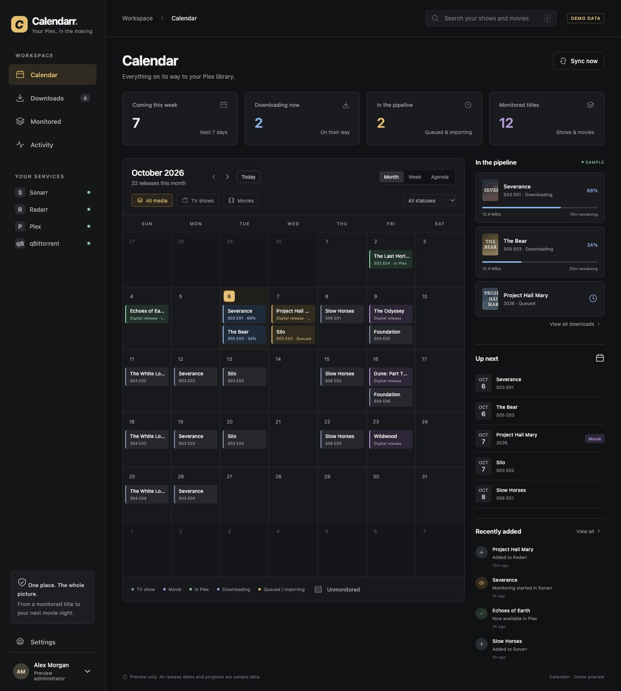
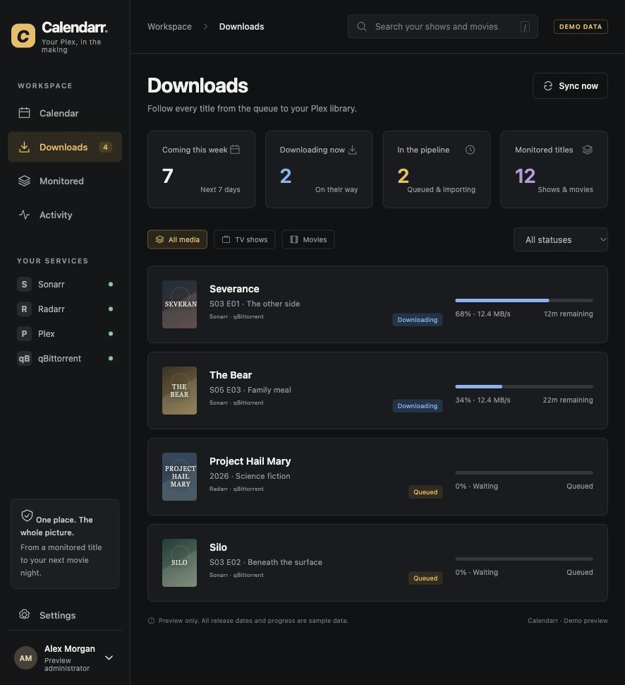
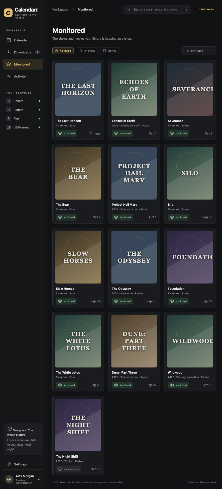
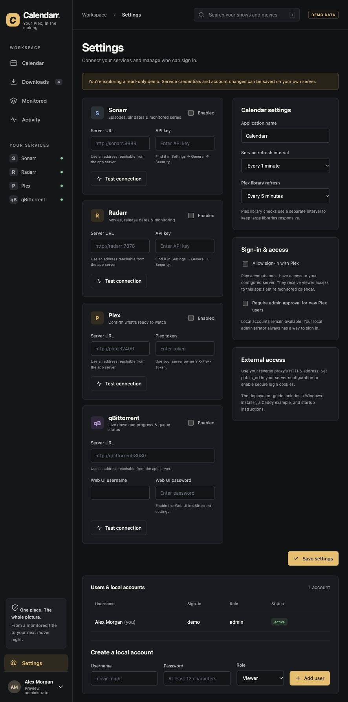
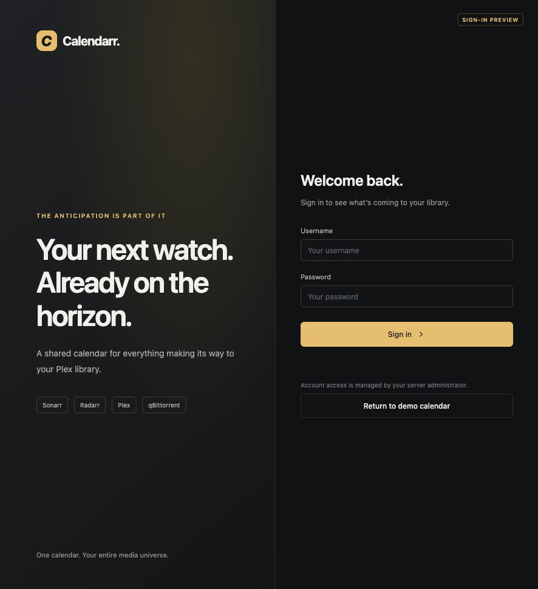

# Calendarr · Plex Calendar

A native Windows server app for the shows and movies making their way to your Plex library. Calendarr reads Sonarr, Radarr, Plex Media Server, and qBittorrent, then gives your users one place to see release dates, download progress, monitoring additions, and confirmed Plex availability.

## What’s included

- Responsive month, week, and agenda calendars with search, media filters, and status filters.
- Download/queue views with progress, speed, ETA, paused/stalled states, and import warnings.
- A monitored catalog and persistent activity history for additions, removals, monitoring changes, and arrivals in Plex.
- A required local administrator, additional local accounts, password changes, and offline admin recovery.
- Optional Plex sign-in with server-access checks and optional administrator approval.
- Admin-only integration settings and connection tests. Credentials are encrypted at rest and never returned to the browser.
- SQLite persistence, independent background polling, and clearly marked cached status during outages.
- A Windows installer, automatic boot startup before sign-in, failure recovery, protected storage, and rotating logs. No separate database or frontend build is needed.

Calendarr reads the upstream services. Add titles, edit monitoring, manage downloads, and scan libraries in their respective applications.

## Screenshots

These previews come from the built-in demo. Titles, release dates, download progress, and the account shown are sample data.

### Calendar

See upcoming episodes and movies, their current status, confirmed Plex availability, and the download pipeline in one month view.



<details>
<summary>Downloads and queue</summary>

Track active downloads and queued items, including progress, speed, and estimated time remaining.



</details>

<details>
<summary>Monitored titles</summary>

Browse the Sonarr and Radarr catalog, monitoring status, and the dates titles were added.



</details>

<details>
<summary>Service settings and accounts</summary>

Administrators connect Sonarr, Radarr, Plex, and qBittorrent, configure refresh intervals and Plex sign-in, and manage local accounts.



</details>

<details>
<summary>Sign-in</summary>

Users sign in with a local account. Optional Plex sign-in can be enabled in Settings; this preview shows the local account screen.



</details>

## Install on Windows

Use Windows 10/11 or Windows Server 2016 or newer, with Windows PowerShell 5.1 or PowerShell 7. Install **64-bit Python 3.14 for all users**, including the Python launcher. Choose **Customize installation → Install for all users** in the [Python Windows installer](https://www.python.org/downloads/windows/). An installation under your user profile cannot be used by the boot task. Python 3.12, 3.13, and 3.14 are supported; the installer prefers 3.14, then 3.13, then 3.12 when using the launcher. Use the standard CPython build.

Download and extract the repository’s ZIP, or clone it with Git:

```powershell
git clone https://github.com/ChiIIerr/Plex-Calendar-App.git
cd Plex-Calendar-App
```

Open **PowerShell as Administrator**, change into the extracted/cloned folder, then run:

```powershell
powershell -NoProfile -ExecutionPolicy Bypass -File .\deploy\install.ps1
```

The installer installs dependencies, creates a dedicated Python environment, registers the **Calendarr** Task Scheduler task, and starts the app. It uses these defaults:

| Item | Location |
| --- | --- |
| App and Python environment | `C:\Program Files\Calendarr` |
| Server configuration | `C:\ProgramData\Calendarr\server.json` |
| Accounts, encrypted credentials, calendar cache/history | `C:\ProgramData\Calendarr\data` |
| Log file | `C:\ProgramData\Calendarr\logs\server.log` |
| Local address | `http://localhost:8282` |

Paths use your system’s actual Program Files/ProgramData locations. App files are readable by Local Service; data/config/logs are accessible only to Local Service, Administrators, and SYSTEM. The task runs under **Local Service**, uses one server process, starts at boot without an interactive Windows login, has no runtime cutoff, and retries a failed process up to five times at one-minute intervals. Unavailable upstream services are handled inside the app and do not kill the server.

For a nondefault installation, supply `-InstallDir`, `-StateDir`, `-TaskName`, `-PythonExe`, `-Port`, or `-PublicUrl`. Use an all-users Python executable with `-PythonExe`. Keep InstallDir and StateDir separate and outside the source checkout. Use the same custom paths/task name on updates, and pass `-StateDir` to the management scripts. `-NoStart` registers startup without immediately launching the server.

### Create the administrator and connect services

Open **http://localhost:8282**. Read the first-run setup token from an elevated PowerShell window:

```powershell
Get-Content "$env:ProgramData\Calendarr\data\setup-token"
```

Enter that token on the setup page, choose a username, and create a password of at least 12 characters. The token file disappears when setup succeeds. There is no default password and no public local-account registration. If you used a custom data location, use the path printed by the installer.

In **Settings**, enter each service’s URL and credentials, test its connection, enable it, and save. Use **Sync now** for the first snapshot. Default polling is every 60 seconds for Arr/download status and every five minutes for Plex.

URLs must be reachable **from your Windows server**. If the services are on that same machine, use:

| Service | Typical address | Credential |
| --- | --- | --- |
| Sonarr | `http://127.0.0.1:8989` | API key from Settings → General → Security |
| Radarr | `http://127.0.0.1:7878` | API key from Settings → General → Security |
| Plex Media Server | `http://127.0.0.1:32400` | Server owner’s `X-Plex-Token` |
| qBittorrent | `http://127.0.0.1:8080` | Web UI username/password |

Use the other machine’s LAN address for services hosted elsewhere. Preserve configured URL bases, such as `http://host:8989/sonarr`. Enable the qBittorrent Web UI, and make sure its host/domain settings accept the URL you use. Calendarr maintains the required login cookie and Origin/Referer headers. It uses Web API v2 username/password login; optional API-key login is not implemented.

### Upgrading an earlier installation

Rerun the installer from the updated source checkout. It detects an earlier native installation, retains its app/data locations, and renames the default startup task to **Calendarr**. Custom task names remain as configured. Run `status.ps1` to see the actual paths if they differ from the defaults above.

To upgrade from Python 3.12 to 3.14, install the all-users Python 3.14 runtime and rerun the installer. When the selected Python major/minor version differs from the installed environment, the installer rebuilds only the app's `.venv` and reinstalls pinned dependencies. Configuration, accounts, encrypted credentials, and calendar history remain in StateDir. Use `-PythonExe 'C:\Program Files\Python314\python.exe'` if needed, replacing that example with your actual all-users Python path.

On first start, Calendarr upgrades the previous database to `calendarr.sqlite3`, including committed journal records, and preserves accounts, encrypted credentials, history, and the original encryption key. The previous database remains as a backup. The previous default display name changes to Calendarr; custom display names are preserved. Existing users sign in again because the browser session cookie has a new name. The old product identifier appears only in the compatibility file used to detect previous installations.

### Start, stop, logs, and updates

Run these scripts from the checkout or the installed `deploy` folder in **PowerShell as Administrator**. Allow scripts for the current window only, if needed:

```powershell
Set-ExecutionPolicy -Scope Process Bypass
.\deploy\status.ps1
.\deploy\stop.ps1
.\deploy\start.ps1
.\deploy\start.ps1 -Restart
Get-Content "$env:ProgramData\Calendarr\logs\server.log" -Tail 50 -Wait
```

`start.ps1 -Foreground` stops the task and runs the app in the current window for troubleshooting; Ctrl+C stops it. Run `start.ps1` afterward to return to background operation. Logs rotate at 5 MB with five retained backups. HTTP access logs are disabled.

To update, download the new ZIP or pull changes into your **source checkout**, then rerun the installer:

```powershell
git pull --ff-only
powershell -NoProfile -ExecutionPolicy Bypass -File .\deploy\install.ps1
```

The installer stops the task, replaces app files, installs pinned dependencies, preserves existing configuration/data, and starts the updated app. Do not run the installer from the copy in Program Files. If an update fails, data is retained; correct the reported problem and rerun it. An update is not an automatic rollback.

To stop the app and remove automatic startup while retaining everything on disk:

```powershell
.\deploy\remove-startup.ps1
```

Rerun the installer from the source checkout to register startup again. `stop.ps1` alone stops the current run; the boot trigger remains enabled.

## External access

Use your existing **HTTPS reverse proxy** on Windows. The default listener is `127.0.0.1:8282`. Point the proxy at that address and edit `C:\ProgramData\Calendarr\server.json` as Administrator:

```json
{
  "bind_host": "127.0.0.1",
  "port": 8282,
  "public_url": "https://calendar.your-domain.example",
  "trusted_proxies": "127.0.0.1,::1",
  "data_dir": "C:\\ProgramData\\Calendarr\\data",
  "log_dir": "C:\\ProgramData\\Calendarr\\logs"
}
```

Restart with `start.ps1 -Restart`. HTTPS public URLs enable secure login cookies automatically. [deploy/Caddyfile.example](deploy/Caddyfile.example) is a configuration example for Caddy running on the same Windows server. Use your existing proxy’s Windows startup setup, or Caddy’s documented Windows service setup, to keep the HTTPS endpoint available after a reboot.

If your proxy runs on another machine, set `bind_host` to the server’s LAN IP, set `trusted_proxies` to the proxy’s actual IP/network, and allow the app port in Windows Firewall **only from that proxy**. Use specific addresses/networks; wildcard proxy trust is rejected. `public_url` must be an HTTP/HTTPS origin without a path prefix. Serve the app at the root of its hostname.

For direct LAN access, use the server’s LAN IP for `bind_host` and `public_url`, and scope a Windows Firewall rule to your LAN. Internet-facing access should go through HTTPS. Expose the calendar proxy endpoint; users do not need direct access to the upstream services. The installer does not create firewall rules or configure your reverse proxy.

The server config is validated before startup. Relative data/log paths resolve against the config file’s directory. For installer-managed setups, keep both inside StateDir so their permissions stay protected. The supplied [example config](deploy/server.example.json) uses relative paths. Do not put integration credentials in this file; enter them in admin Settings.

### Plex sign-in

1. Connect Plex using your server owner’s token, save settings, and complete a successful sync.
2. Enable **Allow sign-in with Plex** in Settings. Optionally enable **Require admin approval**.
3. Users choose **Continue with Plex** on the login screen and approve the sign-in on Plex’s website.
4. Calendarr checks that Plex lists the configured server among that user’s accessible resources. A different Plex account without server access cannot enter.

Plex accounts are always viewers; local accounts provide administrator access. Server access is rechecked every five minutes during an active Plex session. Plex sessions last one hour and local sessions last seven days. Disabling an account or changing its permissions revokes its sessions. An approval requirement applies to **new** Plex accounts; existing approvals remain in place. Administrators can disable or approve accounts from Settings.

**Calendar scope:** every approved viewer can see the entire monitored catalog configured in this app. Calendarr does not apply Plex’s per-library sharing restrictions, parental controls, or title restrictions to calendar visibility. The **Open in Plex** link still uses the viewer’s normal Plex permissions for playback. Require local accounts or individual approval if that broader calendar visibility is not appropriate for your users.

## How statuses work

| Status | Evidence |
| --- | --- |
| Upcoming | A monitored episode/movie has a future air or home-release date. |
| Awaiting release | Monitored, with no current file or matching download. |
| Queued | Arr/qBittorrent reports queued, paused, stopped, stalled, metadata, or file-check state. |
| Downloading | A matching Arr queue entry is downloading; qBittorrent supplies progress/speed/ETA when its download hash matches. |
| Awaiting Plex | Arr reports a file or a completed download, but Plex has not confirmed the item yet. |
| Needs attention | Arr reports a download/import warning or the client reports an error. |
| In Plex | Plex has a matching movie file or episode file in its library. |
| Not monitored | The source item is not monitored; hidden by default in the calendar. |

Movies use the earlier of their digital/physical release dates. A theatrical-only date is explicitly labeled **In theaters · home release TBD**; it does not promise home availability. Titles without a known date remain visible in **Monitored**. Episode air times appear in the viewer’s local timezone; movie releases remain date-only.

Plex matching uses TMDB/IMDb IDs for movies and TVDB ID plus season/episode number for episodes. Modern Plex metadata and common legacy agent IDs are supported. If metadata IDs are missing or episode numbering differs between Plex and Sonarr, the app keeps the item in **Awaiting Plex** rather than guessing from a title. Fix matching/numbering in your source services. Playback confirmation means the item is indexed with an existing media part, not a real-time filesystem read or playback test.

qBittorrent torrents are shown only through matching Sonarr/Radarr queue entries, using download info hashes. Unrelated torrents are not exposed to viewers. Sonarr/Radarr queue progress remains available if qBittorrent is not configured. Once an imported download disappears from the Arr queue, its presence is determined through Arr file status and Plex confirmation.

On the first sync, catalog additions use the original `added` timestamp when the source provides it. Monitoring toggles and removals are recorded when Calendarr observes them; it cannot reconstruct monitoring changes made before it was installed or changes toggled back between polls. The activity log retains the latest 5,000 entries; the Activity page shows the most recent 200. Availability activity is recorded when an observed item transitions into Plex. Existing Plex media does not create a flood of arrival events on initial setup.

## Recover an administrator password

In elevated PowerShell, from the source checkout or installed application folder:

```powershell
Set-ExecutionPolicy -Scope Process Bypass
.\deploy\reset-admin.ps1 -Username YOUR_USERNAME
```

The script uses the installed data location, stops the running task, prompts for a new password without displaying it, and restarts the task if it was running. It re-enables that local admin and revokes their existing sessions. Add `-StateDir` for a custom installation. Recovery requires local administrator access to the server.

## Backup and restore

Stop the task and back up the **entire data directory**, including `calendarr.sqlite3`, any journal files, and **encryption.key**. Also keep `server.json` and a record of custom installation paths. The database and key must stay together; losing the key makes integration credentials unreadable. Start the app again after copying.

To restore on another Windows server, install without starting (`-NoStart`), copy the backed-up data into the installed data directory, then rerun the installer. It reapplies Windows permissions and starts the app using the restored accounts/settings. Update paths in server.json if necessary. The application, data, and Python installation must be on local disks accessible before sign-in; mapped drives are not suitable for boot startup. Do not commit data, setup tokens, or keys to source control.

## Development and demo

For development, make a virtual environment in the source checkout:

```powershell
py -3.14 -m venv .venv
.\.venv\Scripts\python.exe -m pip install -r requirements-dev.txt
.\.venv\Scripts\python.exe -m pytest -q
.\.venv\Scripts\python.exe tests\smoke_native.py
Copy-Item deploy\server.example.json server.json
.\.venv\Scripts\python.exe -m app.server --config server.json
```

The same Python entry point works on macOS/Linux with `.venv/bin/python`; the installer/startup scripts target Windows. Use exactly **one worker**, since polling, login throttling, and pending Plex challenges are in-process.

For a separate sample preview only:

```powershell
$env:DEMO_MODE = '1'
$env:DATA_DIR = 'data/demo'
.\.venv\Scripts\python.exe -m uvicorn app.main:app --host 127.0.0.1 --port 8282 --workers 1 --no-access-log
```

The demo bypasses login for **sample data**, rejects account/config writes, and displays a demo label. Its titles, dates, and download values are illustrative. `app.server` always clears inherited demo flags, so the installed server uses real authentication.

Tests cover authentication/CSRF, viewer permissions, admin preservation, credential encryption/redaction, session revocation, date ranges, download states, monitoring changes, pagination, Plex matching/access, service outages, native configuration, and log rotation. GitHub Actions is configured to run Python 3.12, 3.13, and 3.14 on Windows and Linux, start the real native server, and verify setup/login/persistence. Its Windows jobs additionally test Python discovery, install the app, start it through the Local Service boot task, verify task settings and filesystem permissions, exercise restart and installer updates, and remove startup without deleting data. The Python 3.14 Windows job also upgrades an existing Python 3.12 environment. Upstream-service tests use mock HTTP responses; live connectivity needs your own URLs and credentials.

Dependencies are pinned in `requirements.lock`. The UI uses local fonts and no third-party CDN assets.

## API references

The adapters use the [Sonarr v3 API](https://sonarr.tv/docs/api/), [Radarr v3 API](https://radarr.video/docs/api/), and [qBittorrent Web API v2](https://github.com/qbittorrent/qBittorrent/wiki/WebUI-API-%28qBittorrent-5.0%29). Plex library/PIN behavior follows the endpoints documented by the maintained [Python PlexAPI project](https://python-plexapi.readthedocs.io/en/latest/modules/myplex.html).

Calendarr is an independent project and is not affiliated with Plex, Sonarr, Radarr, or qBittorrent.
